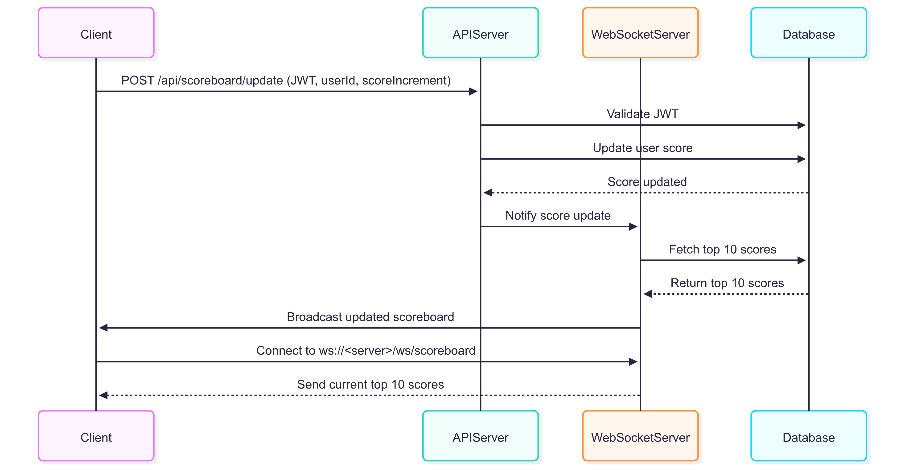

# Task: Scoreboard API Module Specification

Write the specification for a software module on the API service (backend application server).

1. Create a documentation for this module on a `README.md` file.
2. Create a diagram to illustrate the flow of execution. 
3. Add additional comments for improvement you may have in the documentation.
4. Your specification will be given to a backend engineering team to implement.

### Software Requirements

1. We have a website with a score board, which shows the top 10 user’s scores.
2. We want live update of the score board.
3. User can do an action (which we do not need to care what the action is), completing this action will increase the user’s score.
4. Upon completion the action will dispatch an API call to the application server to update the score.
5. We want to prevent malicious users from increasing scores without authorisation.

# Solution

## Overview
This module provides a backend API service for a live-updating scoreboard displaying the top 10 user scores on a website. It handles score updates triggered by user actions and ensures secure, authorized updates to prevent malicious activity. The module supports real-time updates using WebSocket for live scoreboard data and RESTful endpoints for score submissions.


## Architecture
The module is a RESTful API service built on a backend application server, integrated with a WebSocket server for live updates. It uses a relational database (e.g., PostgreSQL) to store user scores and a token-based authentication system to secure API calls.

## Components

- **REST API:** Handles score update requests from client actions.
- **WebSocket Server:** Broadcasts updated top 10 scores to connected clients.
- **Database:** Stores user data and scores.
- **Authentication Service:** Validates user tokens to authorize score updates.

## API Endpoints
### 1. Update User Score

- **Endpoint:** POST /api/scoreboard/update
- **Description:** Updates a user's score after a valid action.
- **Authentication:** Requires a Bearer JWT token in the Authorization header.
- **Request Body:**
```json
{
  "userId": "string",
  "scoreIncrement": "integer"
}
```

- **Response:** 
  - 200 OK: Score updated successfully.
  ```json
  {
    "status": "success",
    "userId": "string",
    "newScore": "integer"
  }
  ```
  - **400 Bad Request:** Invalid request body or negative increment.
  - **401 Unauthorized:** Invalid or missing token.
  - **429 Too Many Requests:** Rate limit exceeded.

- **Security:**
  - JWT token validation to ensure only authorized users can update scores.
  - Rate limiting to prevent abuse (e.g., max 10 requests per minute per user).
  - Input validation to ensure scoreIncrement is a positive integer.


### 2. Get Top 10 Scores

- **Endpoint:** GET /api/scoreboard/top
- **Description:** Retrieves the current top 10 user scores.
-  **Authentication:** None (public endpoint).
- **Response:**
  - 200 OK:
    ```json
    [
      { "userId": "string", "username": "string", "score": "integer" },
      ...
    ]
    ```
  - **500 Internal Server Error:** Database query failure.

- **Notes:**
  - Results are sorted by score in descending order, limited to 10 records.
  - Caching (e.g., Redis) is recommended to reduce database load.


## WebSocket for Live Updates

- **Endpoint:** `ws://<server>/ws/scoreboard`
- **Description:** Clients connect to receive real-time updates of the top 10 scores.
- **Message Format:**
  ```json
  {
    "event": "scoreboardUpdate",
    "data": [
        { "userId": "string", "username": "string", "score": "integer" },
        ...
    ]
  }
  ```

- **Behavior:**
  - On connection, the server sends the current top 10 scores.
  - On score update (via POST /api/scoreboard/update), the server recalculates the top 10 and broadcasts updates to all connected clients.


## Database Schema
```sql
CREATE TABLE users (
  userId VARCHAR(50) PRIMARY KEY,
  username VARCHAR(100) NOT NULL,
  score INTEGER DEFAULT 0,
  lastUpdated TIMESTAMP DEFAULT CURRENT_TIMESTAMP
);
```

**Indexes:**
- Index on score (DESC) for efficient top 10 queries.
- Index on userId for fast lookups during updates.


## Flow of Execution
The following sequence diagram illustrates the interaction between the client, API server, WebSocket server, and database:



## Security Considerations

- **JWT Authentication:** Use a secure JWT library to validate tokens. Tokens should have a short expiration (e.g., 15 minutes) and be refreshed via a separate auth service.
- **Rate Limiting:** Implement rate limiting (e.g., 10 requests/minute/user) to prevent brute-force score manipulation.
- **Input Validation:** Sanitize and validate all inputs to prevent injection attacks (e.g., SQL injection, JSON parsing errors).
- **HTTPS:** Enforce HTTPS for all API and WebSocket connections.
- **CORS:** Restrict CORS to trusted origins to prevent unauthorized access.

## Implementation Notes

- **Framework:** Use a robust framework for the API server.
- **WebSocket:** Use a library like ws (Node.js) for WebSocket support.
- **Database:** PostgreSQL is recommended for its performance and indexing capabilities. - Consider Redis for caching top 10 scores.
- **Logging:** Log all API requests and errors for monitoring and debugging.
- **Testing:** Implement unit tests for API endpoints and integration tests for WebSocket updates.

## Improvements and Future Considerations

- **Caching:** Implement Redis caching for the GET /api/scoreboard/top endpoint to reduce database load. Cache TTL should be short (e.g., 10 seconds) to balance freshness and performance.
- **Scalability:** Use a message queue (e.g., RabbitMQ) to decouple score updates from WebSocket broadcasts for better scalability.
- **Leaderboard History:** Store historical leaderboard snapshots for analytics or user history tracking.
- **Rate Limit Feedback:** Provide clear error messages when users hit rate limits, including retry-after headers.
- **User Anonymity:** Optionally anonymize usernames in the public leaderboard to enhance privacy.
- **WebSocket Reconnection:** Implement reconnection logic on the client side to handle temporary WebSocket disconnections gracefully.

## Deployment

- Deploy the API and WebSocket servers behind a load balancer to handle high traffic.
- Use a managed database service for reliability and backups.
- Monitor API performance and WebSocket connection counts to ensure scalability.
